# Forthink UWB Sniffer Tool

## 1. Introduction

UWB Dongle Sniffer Tool is work with the [UWB Dongle Sniffer Module](UWB_Dongle_Sniffer_module.md), which helps Makers quickly understand UWB signal propagation and operation. And with the tool will be easier to scan and track UWB signals to improve work efficiency.

Key features and benefits of the `UWB Dongle Sniffer Tool` for Makers:

1. **UWB Signal Propagation Analysis:**
   - The software allows Makers to capture and visualize UWB signal timing
   - The UWB signal RSSI analysis
   - UWB Channel impluse Response estimation and analysis

2. **UWB Protocol Monitoring and Decryption:**
   - The software supports the monitoring and decrypting of various UWB protocols, such as CCC, FiRa, and IEEE 802.15.4a/z.
   - Makers can analyze the real-time communication between UWB devices, identify protocol-specific behaviors, and troubleshoot any connectivity or interoperability issues.
   - The timing of the UWB Protocols

3. **UWB Signal Scanning and Tracking**:
   - The software provides a user-friendly interface for Makers to scan the UWB channel, detect active UWB transmissions, and track individual UWB sessions.
   - This functionality enables Makers to quickly identify and investigate specific UWB communication scenarios, facilitating the development, testing, and optimization of UWB-based applications and systems.

The UWB PHY of the Module compatible with IEEE 802.15.4a/z, and support the FiRa/CCC MAC Specification.

With the `exe\Sniffer-v1.0.0.exe` , you can easily do works like:

 - Quick scan of the UWB signals around
 - Easily monitor the UWB channel
 - Tracking a UWB Session like the CCC Digital Key 3.0 Session; FiRa session, like the Apple Airtag, which will helps better understanding of how the UWB session works
 - With the specific Session Parameters, can helps to debug the FiRa/CCC Session process
 - Quick send Testing UWB packets

## 2. Quick Start

### 2.1 Hardware

- UWB Dongle Sniffer Module
- Windows PC

### 2.2 Device Connection

Plug the UWB Dongle Sniffer Module into the USB port (USB 2.0/3.0). The Sniffer device will be displayed as FT4222H A/B interfaces in the Device Manager. 

UWB Dongle Sniffer Tool will automatically select the detected UWB-Sniffer devices and display its UWB device ID (UID). The "Settings" page will show as below:

  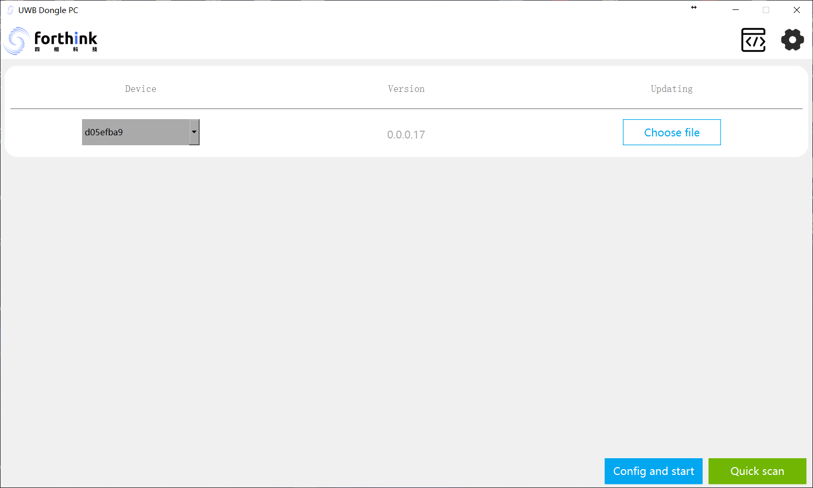

### 2.3 Quick Scan

Click the "Quick scan" button 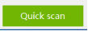on "Settings" page will quickly scan nearby UWB devices, and to track UWB frames under a specific parameter group detected in the scan.

1. On the "Settings" page, click "Quick scan" at the bottom right corner. The Sniffer device will enter the "Scanner" page and start scanning for nearby UWB devices immediately.

  

1. After the scan results are displayed on the page, you can click the skip button  at the scan results row at any time to start tracking. This means listening to the scaned UWB devices that meet the PHY parameter combination of that row. If you start tracking before the scan is complete, click "OK" in the pop-up window to enter the "Listener" page. From the Scan results, you can easily know what UWB signal around: which UWB Channel? PRF? Data rate is 6M8 or 7.8, etc.

  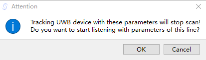

3. On the "Listener" page, click the start button  at the top right corner. The software will begin listening and analyzing based on the current protocol parameters. This method only configures PHY protocol parameters and therefore cannot handle operations involving the MAC layer, such as session parameters decryption. 

  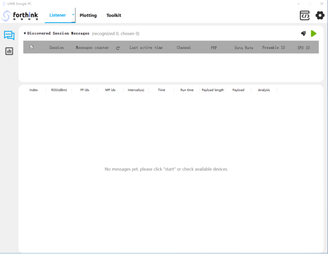

## 3. Listener
"Listener" page can be used to listen and decrypt UWB frames that are consistent with the Sniffer device's protocol parameters. 
You can enter the Listener page by configuring the protocol parameters after clicking the "Config and Start" button on the configuration page, or tracking through "Quick scan".

  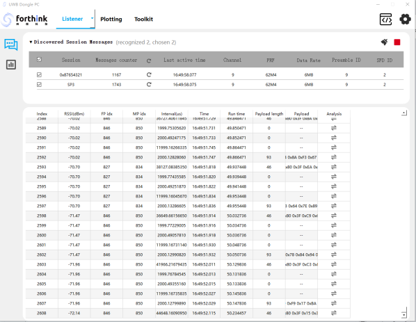

As long as the PHY protocol parameters of the Sniffer device and the device being monitored are the same, UWB data frames can be captured. However, UWB data frames can only be decrypted if the MAC protocol parameters are consistent.

### 3.1 Frame Sequence Chart
Click the  button to switch to the "Frame Sequence Chart" page, where you can view the timing diagrams of the successfully listened frames. 

  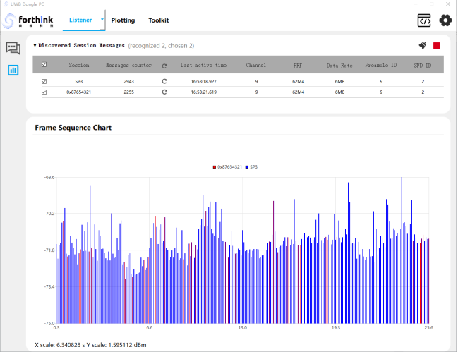

The horizontal axis represents time, while the vertical axis represents the signal strength of the frame. 
You can use the mouse wheel to zoom in and out, drag, right-click on the chart to perform operations such as cursor measurement and save the image, etc.

## 4. Plotting
The "Plotting" page is used for analysis of the listening results when the Listener is active.
### 4.1 Receiving Parameters

  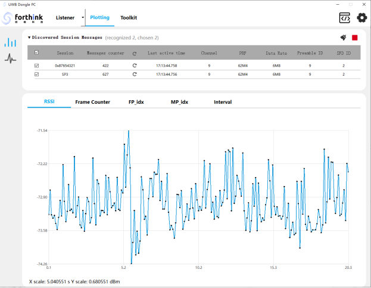

### 4.2 Channel Impulse Response

  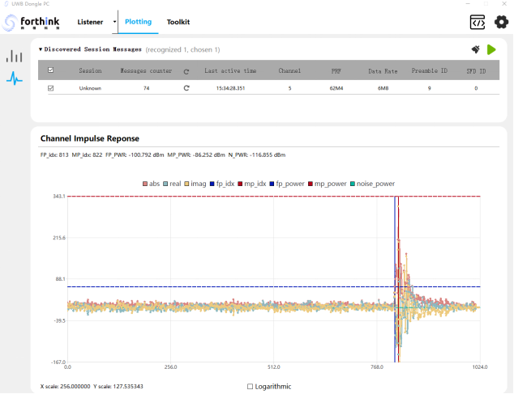

## 5. Transmitter
It can be used to transmit UWB frames with specific payloads, with transmission protocol parameters displayed in the "Current PHY Parameter" table, which from quick scan and tracking or the parameters configured on the "Protocol Configuration" page.

  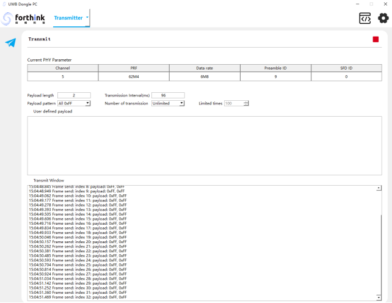

## 6. Examples

### 6.1 iOS CCC Car keys test params

Apple [Car Keys Test App](https://apps.apple.com/us/app/car-keys-tests/id1635860023) UWB Params: 

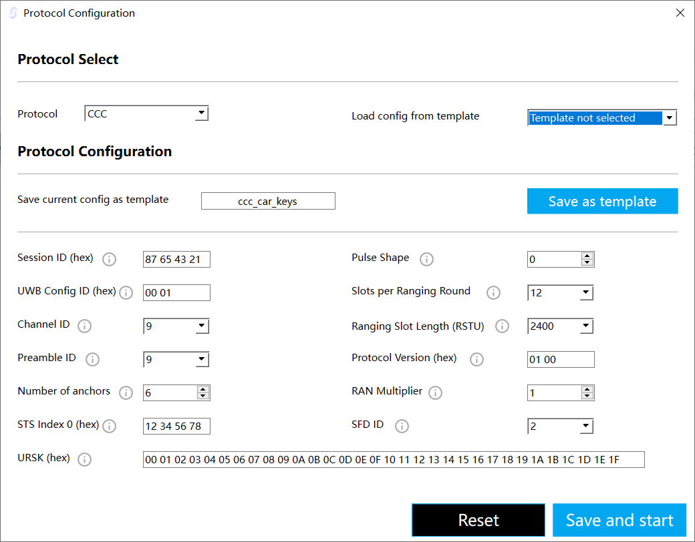

*Note: The App needs Apple MFI.*

### 6.2 iPhone Airtag

The iPhone Airtag use the FiRa protocol, but it's KEY(Vupper64), Session ID from the BLE OOB, if want decrypt the information, some work needs to do. The Fira Parameter Setting like below:

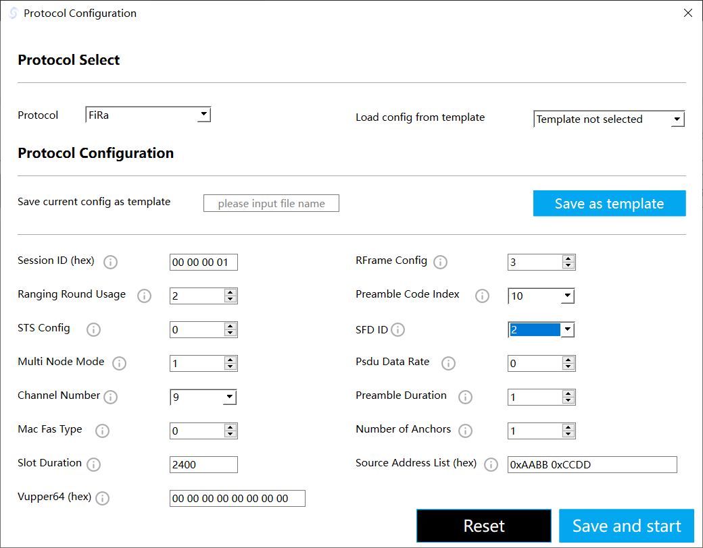

## 7. Release log

### (2024.12.23-v1.0.6)
* Features:
   * Add page turning function.
   * Add the UWB-Dongle-Sniffer pkg and SWUP(Software Update Program) tool.
* Fixed:
   * Repair some bugs: SP3 frame judgment; CIR mode bug.
* Known issue:
   *  Frame loss during listening, meaning that some frames may not be received.

### (2024.07.17-v1.0.0)
* Features:
   * None
* Fixed:
   * None
* Known issue:
   *  Frame loss during listening, meaning that some frames may not be received.

## Contact

Email: dksupports@everhigh.com.cn