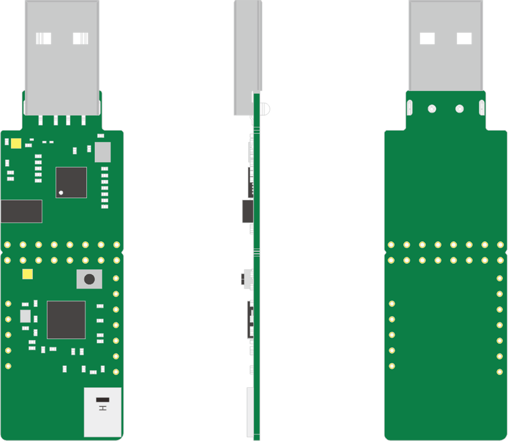

# UWB Dongle Sniffer Module

## 1. Introduction
UWB Dongle Sniffer Module use the NXP NCJ29D5 UWB Chip and the FT4222 USB-SPI communication with the PC, Raspberry Pi, and other Smart Devices.

The UWB PHY of the Module compatible with IEEE 802.15.4a/z, and support the FiRa/CCC MAC Specification.

With the [Sniffer-Tool]() , you can easily do works like:

 - Quick scan of the UWB signal around
 - Easily monitor the UWB channel
 - Tracking a UWB Session like the CCC Digital Key 3.0 Session; FiRa session, like the Apple Airtag, which helps better understanding of how the UWB session works
 - With the specific Session Parameters, can helps to debug the FiRa/CCC Session process

## 2. Main Features

- Compatible UWB Channel : 5/6/8/9
- Support IEEE 802.15.4a/z
- Support FiRa 1.1/ CCC 1.0.0 protocol
- Minimum monitor interval: 1ms
- Quick Scan of the UWB signal
- Tracking of Standard FiRa/CCC Protocols
- UWB Frame Transmit and Receive
- Device UWB Power estimation
- UWB Frame estimation with the specific parameters

## 3. Specifications

|             Parameters              |        Description        |
| :---------------------------------: | :-----------------------: |
|            UWB Standard             | IEEE Std 802.15.4a/z-2020 |
|              UWB Chip               |          NCJ29D5          |
|              Frequency              |    5/6/8/9 (6.0G~8.5G)    |
|       Supported MAC Protocols       |         FiRa, CCC         |
|       Typical Transmit Power        |       -41.3dbm/MHz        |
|       Maximum Transmit Power        |        -23dbm/MHz         |
|            LOS Max Range            |           100m            |
|         Data Transfer Rate          |      6.8Mbps/7.8Mbps      |
|        Receiver Sensitivity         |          ≤-95dbm          |
|             Module Size             |      72.0x20.0x1.0mm      |
|        Operating Temperature        |       -20°C to 60°C       |
|         Storage Temperature         |       -40°C to 85°C       |
|          Operating Voltage          |         4.5-5.5V          |
|          Operating Current          |          ≤200mA           |
|           Online Upgrade            |         Supported         |
| Host Communication /Power Interface |           USB-A           |
